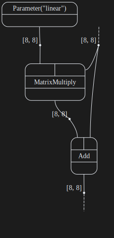
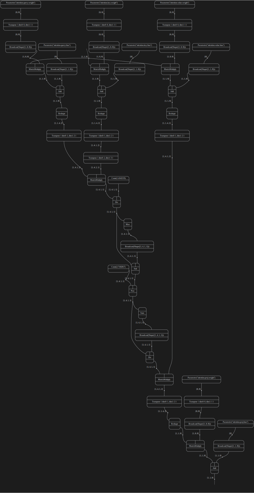

# Examples of LLM layer visualisation

... with [catgrad](https://github.com/hellas-ai/catgrad)
and [open-hypergraphs](https://github.com/hellas-ai/open-hypergraphs).

Residual layers:

Attention layers:

